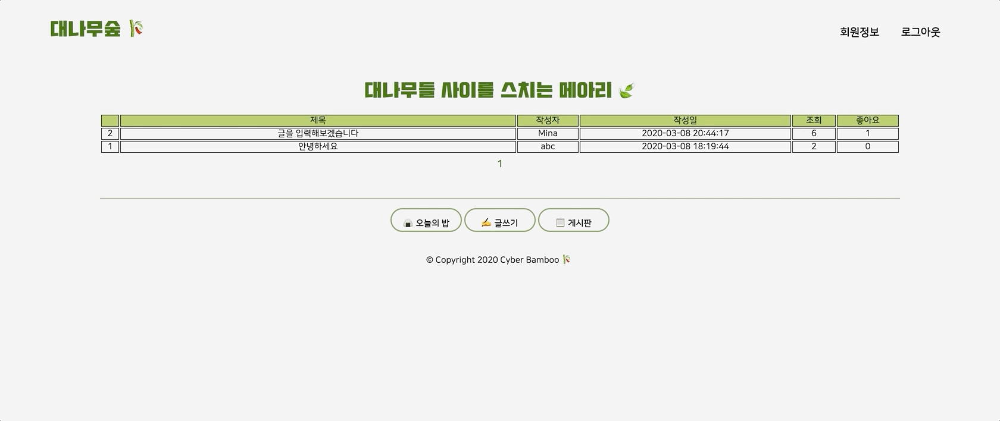

# 시큐어 C반 대나무숲

> Cyber Bamboo 🎋

## Overview

- 같은 반 학생들을 위한 익명의 게시판 서비스
- Node.js를 활용한 Server-side Rendering App

## Features

1. 회원관리

- 회원가입 : Email, Password, Name 입력 후 가입
- 로그인 : Email, Password로 로그인
- 회원정보 탭에서 유저 이름과 이메일 변경 가능

2. 게시판

- CRUD (Create, Read, Update, Delete)
- 글을 조회할 때마다 해당 글의 조회 수가 1씩 증가
- 글 좋아요 버튼을 누를 때마다 해당 글의 좋아요 수가 1씩 증가

3. 오늘의 밥

- GS타워 및 멀티캠퍼스 구내식당 메뉴 업로드 (수동)

3. 그 외 수정되거나 추가해야 할 기능

- 회원정보 수정 시 이메일이 아니라 이름과 비밀번호만 수정하도록 변경
- 게시판 글 및 댓글 수정 기능
- 회원정보 탭에서 내가 쓴 글 클릭 시 해당 글로 넘어갈 수 있는 기능

## Demo

1. 회원가입 및 로그인
   

2. 게시판 및 글쓰기
   

3. 댓글
   

4. 오늘의 밥 확인
   

5. 회원 정보 변경 및 글 삭제
   

6. 로그아웃
   

## Technologies

- Language

  - JavaScript
  - Node.js
  - MySQL

- Framework, Libraries

  - jquery
  - Express
  - npm

    - nodemon (dev)
    - ejs

## Contribution

- @kkoomin
- @freeland120
